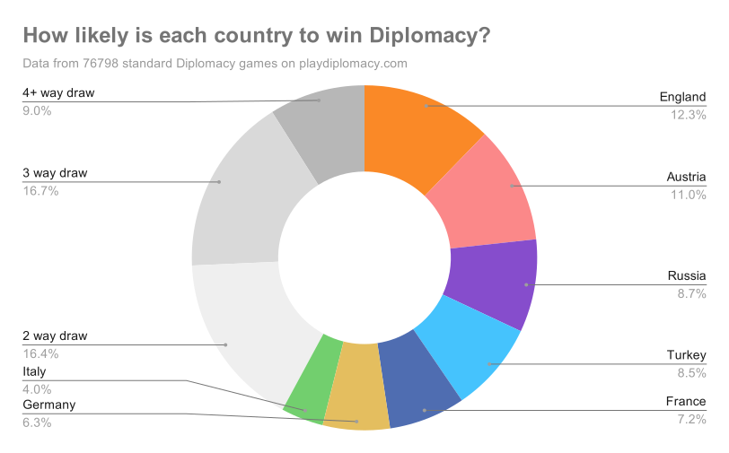

# Diplomacy data
I scraped every standard Diplomacy game (as of 28/2/2021) on playdiplomacy.com - here's the data.

- There are 76798 standard Diplomacy games included in the dataset - ones with no result were ignored
- `diplomacy-raw.csv` has all the raw data, while `diplomacy-data` has the totals 
- See the data in a google sheets doc [here](https://docs.google.com/spreadsheets/d/1ly2ZNI3dyMGDnY0YTsxezdPNtWYugpTxTfrSXItgpbY/edit?usp=sharing).

# Results

